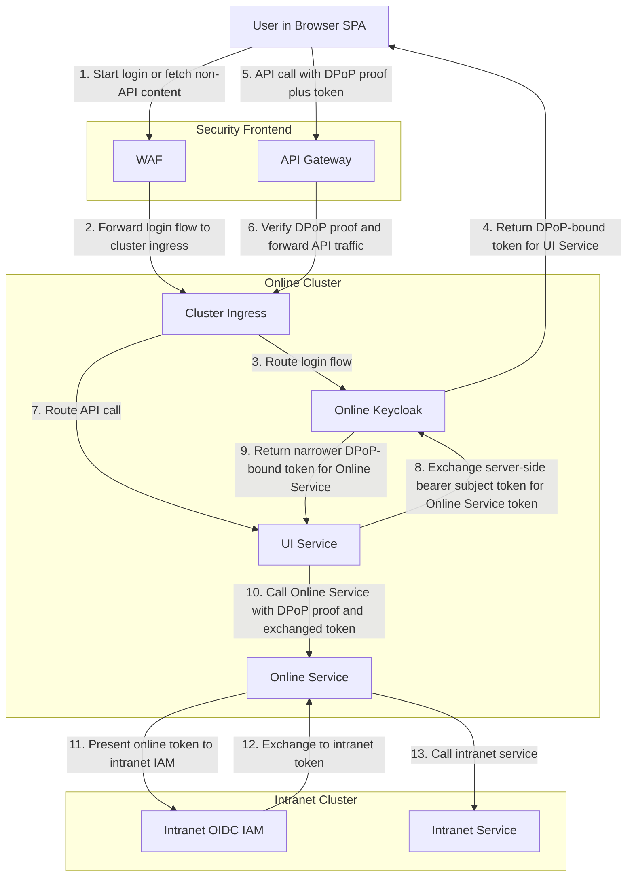

# Proposal: DPoP at the Edge and Token Exchange Per Hop

This keeps the general shape of the current architecture, but replaces the gateway cookie pattern with sender-constrained tokens and stops raw token chaining between services.

## What Changes

- The browser receives a DPoP-bound token rather than a bearer token.
- The security frontend is split into WAF for login and non-API traffic, and API gateway for API traffic.
- The gateway validates DPoP proofs instead of relying on a custom cookie as the only anti-exfiltration control.
- The first API is the final audience of the browser token.
- Every downstream hop uses Keycloak token exchange to issue a new token with a narrower audience and scope.
- Because Keycloak 26.6.0 does not accept a DPoP-bound `subject_token` in standard token exchange, the DPoP token ends at the first service. The token sent to Keycloak for exchange must be a bearer access token held server-side.
- Exchanged tokens carry separate user and workload information, for example by recording the calling client context.
- Internal online calls use Keycloak token exchange. For intranet calls, `Online Service` presents a trusted online token to the intranet IAM using JWT bearer authorization grant semantics.

## Activity View



## Concrete Example

```mermaid
sequenceDiagram
    participant UI as Browser UI
    participant WAF as WAF
    participant GW as API Gateway
    participant ING as Cluster Ingress
    participant KC1 as Online Keycloak
    participant UIS as UI Service
    participant OLS as Online Service
    participant KC2 as Intranet OIDC IAM
    participant INS as Intranet Service

    UI->>WAF: Start login
    WAF->>ING: Forward login traffic
    ING->>KC1: Route login
    KC1-->>UI: DPoP-bound token for UI Service

    UI->>GW: Call UI Service with token + DPoP proof
    GW->>GW: Verify DPoP proof
    GW->>ING: Forward API call
    ING->>UIS: Route request
    Note over UIS: DPoP edge token ends here; use bearer subject token for exchange
    UIS->>KC1: Token exchange for Online Service audience + client authentication
    KC1-->>UIS: DPoP-bound token for Online Service
    UIS->>OLS: Call Online Service with exchanged token + DPoP proof
    OLS->>KC2: JWT bearer grant with online token
    KC2-->>OLS: Access token for Intranet Service
    OLS->>INS: Call Intranet Service
```

In this variant, `Cluster ingress` routes only. DPoP validation is shown at the API gateway on the edge. `Online Service` calls the intranet IAM directly for the final exchange. The `UI Service -> Online Keycloak` step uses a bearer `subject_token`; the DPoP-bound edge token is not sent as `subject_token`.

## Why It Helps

- A stolen token is less useful because the attacker also needs the sender key material.
- The browser token is only valid for the first API audience, not the full service chain.
- Service-to-service scopes can be reduced to the exact downstream need.
- User identity and workload identity can be represented separately in exchanged tokens.
- Trust between online tokens and the intranet IAM becomes a first-class design decision.

## How DPoP Works Here

- The browser holds a key pair and sends a signed DPoP proof with the token request and with API calls.
- Online Keycloak binds the issued token to that proof key by putting the key thumbprint into the token confirmation data.
- The API gateway validates:
  - the DPoP proof signature
  - the DPoP proof target URI and method
  - the match between the proof key and the token confirmation data
- For service-to-service calls, the same pattern applies only if the calling service and the receiving service both support DPoP.

In this proposal, the gateway validates DPoP on the edge. `Cluster ingress` still only routes.

## How Token Exchange Works Here

- `UI Service` exchanges the user token for a token whose audience is `Online Service`.
- In Keycloak 26.6.0, that `subject_token` must be a bearer access token. A DPoP-bound access token cannot be exchanged directly.
- The token request itself authenticates `UI Service` as a confidential client. If cluster identity is used there, it appears on this `UI Service -> Online Keycloak` call.
- Online Keycloak checks the source token, the requesting client, the requested audience, and the requested scopes.
- Online Keycloak then issues a new token targeted to `Online Service`.

This is the part of the proposal that maps cleanly to current Keycloak standard token exchange.

## How Intranet Exchange Works Here

- `Online Service` receives an online access token from Keycloak for itself.
- When it needs an intranet token, it sends that online token to the intranet IAM using JWT bearer authorization grant semantics.
- The intranet IAM decides whether the online issuer, audience, and token claims are acceptable for exchange.
- DPoP does not have to continue into the intranet domain. The proposal only requires that the intranet IAM trust the online token enough to exchange it.

## Keycloak Reality Check

- DPoP is supported in Keycloak 26.6.0.
- Standard token exchange V2 is supported in Keycloak 26.6.0, but only for internal-token to internal-token exchange.
- The exchange from `UI Service` to `Online Service` matches supported Keycloak standard token exchange V2 only when the exchanged `subject_token` is bearer.
- If the design requires the browser's DPoP-bound token itself to be the exchanged `subject_token`, Keycloak 26.6.0 does not support that. That variant needs another STS, a custom extension, or a different flow.
- If cluster identity should replace static client secrets for `UI Service -> Keycloak`, Keycloak 26.6.0 can use federated client authentication with Kubernetes service account assertions. Using a raw SPIFFE JWT-SVID directly remains a preview-oriented path, not a plain out-of-the-box setup.
- The intranet step is not done in Keycloak.
- The proposal assumes the intranet IAM supports JWT bearer authorization grant or an equivalent token-exchange pattern for trusted online tokens.
- If the intranet IAM also requires workload authentication, SPIFFE-based or JWT client assertion-based client authentication can be used there.

## Standards and Tools

- `DPoP`: binds a token to the sender key so a copied token is harder to replay elsewhere.
- `OIDC`: still used for user login.
- `WAF`: handles login traffic and non-API frontend traffic on a separate path from the API gateway.
- `API Gateway`: handles API traffic and validates DPoP before routing into the online cluster.
- `Cluster ingress`: internal entry point for traffic coming from the WAF or the API gateway.
- `OAuth 2.0 access tokens`: still used on every in-cluster service hop.
- `OAuth 2.0 Token Exchange`: each online API hop gets a fresh token for the next online audience instead of forwarding the old one.
- `JWT Bearer Authorization Grant`: used at the intranet IAM to exchange a trusted online token for an intranet token.
- `Keycloak`: issues the browser token and performs online token exchange. It does not perform the final intranet exchange in this proposal.

## Example Calls

Example authorization-code token request with DPoP:

```http
POST /realms/online/protocol/openid-connect/token
Host: keycloak.online.example
Content-Type: application/x-www-form-urlencoded
DPoP: eyJhbGciOiJFUzI1NiIsImp3ayI6eyJrdHkiOiJFQyIsImNydiI6IlAtMjU2Iiwi...

grant_type=authorization_code&
client_id=spa-public&
code=SplxlOBeZQQYbYS6WxSbIA&
redirect_uri=https%3A%2F%2Fapp.example.com%2Fcallback&
code_verifier=dBjftJeZ4CVP-mB92K27uhbUJU1p1r_wW1gFWFOEjXk
```

Illustrative DPoP proof payload for a call to API B:

```json
{
  "htu": "https://api-b.online.example/orders/123",
  "htm": "GET",
  "jti": "0d9b4a4e-0a9a-4f5f-8b20-3bf1e4c0d2c1",
  "iat": 1718000000,
  "ath": "fQnJt6Q6m0pN4Yw9..."
}
```

Example token exchange from UI Service to Keycloak for Online Service:

```http
POST /realms/online/protocol/openid-connect/token
Host: keycloak.online.example
Content-Type: application/x-www-form-urlencoded

grant_type=urn:ietf:params:oauth:grant-type:token-exchange&
client_id=ui-service&
client_secret=...&
subject_token=eyJ...server_side_bearer_user_token...&
subject_token_type=urn:ietf:params:oauth:token-type:access_token&
requested_token_type=urn:ietf:params:oauth:token-type:access_token&
audience=online-service&
scope=orders.read
```

Example same request with workload identity used as client authentication to Keycloak:

```http
POST /realms/online/protocol/openid-connect/token
Host: keycloak.online.example
Content-Type: application/x-www-form-urlencoded
DPoP: eyJhbGciOiJFUzI1NiIsImp3ayI6eyJrdHkiOiJFQyIsImNydiI6IlAtMjU2Iiwi...

grant_type=urn:ietf:params:oauth:grant-type:token-exchange&
client_assertion_type=urn:ietf:params:oauth:client-assertion-type:jwt-bearer&
client_assertion=eyJ...cluster_workload_assertion...&
subject_token=eyJ...server_side_bearer_user_token...&
subject_token_type=urn:ietf:params:oauth:token-type:access_token&
requested_token_type=urn:ietf:params:oauth:token-type:access_token&
audience=online-service&
scope=orders.read
```

Here the DPoP proof binds the issued token for `online-service`, but the exchanged `subject_token` remains bearer because that is what Keycloak 26.6.0 accepts.

Example Online Service token claims after exchange:

```json
{
  "iss": "https://keycloak.online.example/realms/online",
  "aud": "online-service",
  "scope": "orders.read",
  "cnf": {
    "jkt": "NzbLsXh8uDCcdpPmenGz8dwP4w7Lea8fRjA5xZ2xV4A"
  }
}
```

This claim shape matches current Keycloak more closely than an explicit delegated `act` claim.

Example JWT bearer grant from Online Service to intranet IAM:

```http
POST /oauth2/token
Host: intranet-iam.example
Content-Type: application/x-www-form-urlencoded

grant_type=urn:ietf:params:oauth:grant-type:jwt-bearer&
assertion=eyJ...online_service_token_from_keycloak...&
scope=intranet.read
```

## Main Tradeoffs

- DPoP does not remove the token from the browser. It reduces replay risk by sender-constraining the token.
- Each calling workload must manage key material and generate DPoP proofs if DPoP is used on every backend hop.
- Any component that changes HTTP method, URL, or host between the client and the target service will break DPoP proof verification.
