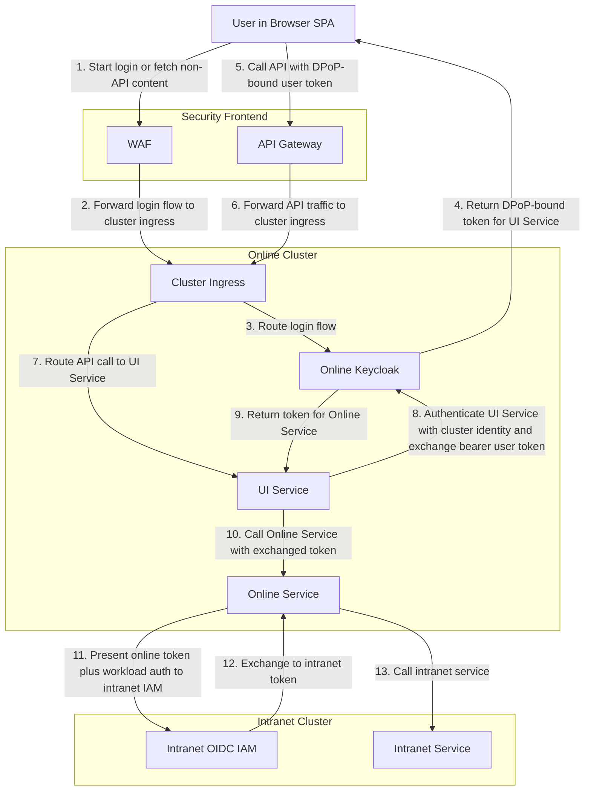
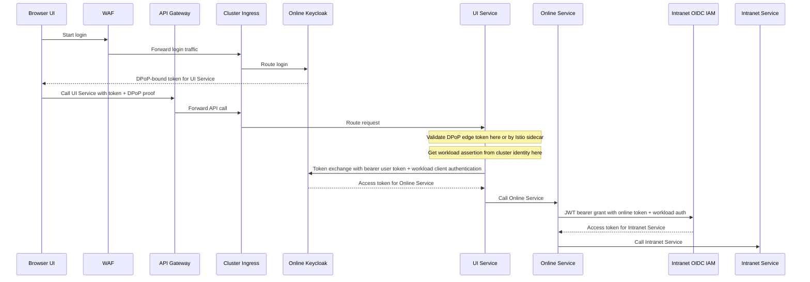

# Proposal: Edge DPoP, Workload Identity, Keycloak Exchange

This is the cleanest separation between user identity and workload identity. DPoP protects the user-facing token at the edge, workload identity identifies the calling service inside the cluster, and Keycloak handles authorization token exchange.

## What Changes

- The edge still uses an OAuth access token for the user, preferably sender-constrained with DPoP.
- The security frontend is split into WAF for login and non-API traffic, and API gateway for API traffic.
- Internal service authentication is based on workload identity, not on forwarding the user token hop by hop.
- The existing service mesh can supply workload identity for caller context inside the cluster.
- Each service also uses an exchanged OAuth token for downstream authorization decisions.
- When a service calls Keycloak, cluster identity is presented on that token request as client authentication. That is the point where workload identity enters the IAM flow.
- Because Keycloak 26.6.0 does not accept a DPoP-bound `subject_token` in standard token exchange, the edge DPoP token ends at the first service. The token sent to Keycloak for exchange must be a bearer access token held server-side.
- For intranet calls, `Online Service` presents a trusted online token to the intranet IAM and can authenticate its workload identity separately, for example with SPIFFE.
- Transaction tokens are optional. Add them only if request-chain context must exist as a separate signed artifact instead of being carried in exchanged access-token claims.

## Activity View



In this variant, `Cluster ingress` still only routes. The user token is validated either in `UI Service` itself or by an `Istio sidecar` attached to `UI Service`. Cluster identity is used on the `UI Service -> Online Keycloak` call. `Online Service` calls the intranet IAM directly for the final exchange.

## Concrete Example



## Why It Helps

- User identity, workload identity, and transaction context are modeled as different things, which matches the actual trust problem more closely.
- Internal workloads authenticate with platform workload identity instead of sharing or reusing user-facing OAuth tokens.
- User context can still flow through exchanged access tokens without treating the original browser token as the universal artifact for every hop.
- Cross-IAM trust becomes an explicit intranet-IAM decision about which online tokens and workloads it accepts.

## What SPIFFE and WIMSE Mean Here

- `SPIFFE`: a standard name format for workloads. In this proposal it answers the question "which online service is calling?" A typical value is `spiffe://online.example/ns/apps/sa/ui-service`.
- `WIMSE`: current IETF work about how workload identity and security context can be represented and exchanged across systems. In this proposal it matters at the handoff where workload identity is presented to the online IAM or the intranet IAM, for example when a cluster-issued workload assertion is transformed into something the IAM accepts.
- `Istio`: relevant here only if an Istio sidecar is the place where that workload identity is sourced from or enforced.
- `Transaction tokens`: optional. Use them only if request-chain context must be carried as a separate signed artifact instead of normal exchanged-token claims.

## Where Cluster Identity Is Used

The diagrams use cluster identity in exactly one place on the online side:

- `UI Service -> Online Keycloak`

That request has two separate security inputs:

- `subject_token`: the bearer access token representing the user context for the exchange
- client authentication: the workload identity of `UI Service`

In Keycloak 26.6.0, this is modeled as standard token exchange plus client authentication on the token request. It is not modeled as ingress validation.

## How One Token Carries Both Identities

In the standards-based model, the resulting access token carries:

- the end user as the normal token subject, usually in `sub`
- the calling workload as delegated actor context, usually in `act`

That gives a token shape like this:

```json
{
  "iss": "https://keycloak.online.example/realms/online",
  "sub": "248289761001",
  "aud": "online-service",
  "scope": "orders.read",
  "act": {
    "sub": "spiffe://online.example/ns/apps/sa/ui-service"
  }
}
```

Meaning:

- `sub`: which user the request is about
- `act.sub`: which workload is currently acting for that user

This is the cleanest standards-based representation because it keeps user identity and workload identity separate inside one OAuth access token.

For the current Keycloak-compatible form of this proposal, the same distinction exists, but the workload identity is usually visible to Keycloak through client authentication of the exchanging service rather than through an explicit `act` claim in the issued token.

## How This Differs From Transaction Tokens

A transaction token is a different design choice.

With the single-access-token approach:

- one OAuth access token is sent to the next service
- that token carries both:
  - user identity, for example in `sub`
  - workload identity, for example in `act`
- the same token is both:
  - the authorization token for the next audience
  - the container for propagated call-chain identity context

With the transaction-token approach:

- the access token and the propagated call-chain context are separate artifacts
- the access token is for authorization to the next audience
- the transaction token carries preserved request context across the call chain
- a service can replace or re-issue the access token for the next audience without losing the original transaction context

In short:

- single access token:
  "who is the user?" and "which workload is acting?" are embedded into the same audience-specific access token
- transaction token:
  the audience-specific access token is separate from the call-chain context token

That gives a flow difference like this:

- single access token:
  `UI Service -> Keycloak -> token for Online Service with user + actor context`
- transaction token:
  `UI Service -> keep txn-token for call-chain context`
  `UI Service -> Keycloak -> access token for Online Service`

The practical tradeoff is:

- single access token:
  simpler artifact count, but the access token has to carry both authorization and propagation context
- transaction token:
  clearer separation of responsibilities, but every hop must handle two security artifacts instead of one

The current OAuth Transaction Tokens draft explicitly positions transaction tokens as a way to preserve user identity, workload identity, and authorization context throughout the call chain inside a trusted domain. That makes them conceptually closer to "separate propagated context token" than to "put everything into the access token".

## How Intranet Exchange Works Here

- `Online Service` first obtains an online access token from Keycloak for itself.
- When it needs an intranet token, it presents that online token to the intranet IAM using JWT bearer authorization grant semantics.
- If the intranet IAM requires workload authentication, `Online Service` also authenticates separately, for example with a SPIFFE-based client assertion or another workload-bound client assertion.
- The intranet IAM decides both:
  - whether the online token is trusted enough for exchange
  - whether the workload identity is acceptable for the client making the exchange

## Keycloak Reality Check

Current Keycloak does not document support for RFC 8693 delegation semantics such as:

- accepting `actor_token` in standard token exchange
- issuing an `act` claim in the exchanged token out of the box

So there are two different versions of this proposal:

- Standards target:
  use `subject_token` for the user and `actor_token` for workload identity, then issue an access token with `sub` plus `act`
- Current Keycloak target:
  authenticate the calling service to Keycloak with workload-based client authentication, for example federated client authentication from Kubernetes or another trusted cluster issuer, then exchange the user token for a new audience-specific token

Two additional Keycloak 26.6.0 constraints matter here:

- Standard token exchange does not accept a DPoP-bound `subject_token`, so the exchanged user token must be bearer.
- Federated client authentication is available for Kubernetes service account and OpenID Connect assertions. Using a raw SPIFFE JWT-SVID directly is not a documented out-of-the-box path and would require additional trust integration or an extension.

With current Keycloak, the resulting token can identify:

- the user in `sub`
- the requesting client in client-related claims such as `azp`

But it will not automatically carry explicit delegated actor identity in `act` unless you add:

- a custom Keycloak extension
- custom protocol mappers
- or a separate STS in front of or beside Keycloak

## Standards and Tools

- `DPoP`: protects the user-facing access token at the edge.
- `WAF`: handles login traffic and non-API frontend traffic on a separate path from the API gateway.
- `API Gateway`: handles API traffic and routes authenticated calls into the online cluster.
- `Cluster ingress`: internal entry point for traffic coming from the WAF or the API gateway.
- `OAuth 2.0 access tokens`: still used on each service hop for authorization context.
- `OAuth 2.0 Token Exchange`: lets Keycloak issue a fresh token for each downstream online audience.
- `Client authentication on the token endpoint`: this is where workload identity is presented to Keycloak on the online side.
- `JWT Bearer Authorization Grant`: used at the intranet IAM to exchange a trusted online token for an intranet token.
- `Keycloak`: the online IAM, owning user login and online token exchange.
- `OIDC-compliant IAM`: assumed on the intranet side, but the product is intentionally left unspecified.
- `Workload identity`: used here to tell Keycloak which online service is calling, separate from which end user started the request.

## Example Calls

Example SPIFFE-style workload identity for UI Service:

```text
spiffe://online.example/ns/apps/sa/ui-service
```

Illustrative workload assertion derived from cluster identity and presented to Keycloak:

```json
{
  "iss": "https://mesh.online.example",
  "sub": "spiffe://online.example/ns/apps/sa/ui-service",
  "aud": "https://keycloak.online.example/realms/online",
  "kubernetes": {
    "namespace": "apps",
    "service_account": "ui-service",
    "pod": "ui-service-7d8b6c7d9d-x2k9m"
  }
}
```

Example token exchange in the standards-based delegation shape:

```http
POST /realms/online/protocol/openid-connect/token
Host: keycloak.online.example
Content-Type: application/x-www-form-urlencoded

grant_type=urn:ietf:params:oauth:grant-type:token-exchange&
client_id=ui-service&
client_secret=...&
subject_token=eyJ...bearer_user_context_token...&
subject_token_type=urn:ietf:params:oauth:token-type:access_token&
actor_token=eyJ...workload_identity_jwt...&
actor_token_type=urn:ietf:params:oauth:token-type:jwt&
requested_token_type=urn:ietf:params:oauth:token-type:access_token&
audience=online-service&
scope=orders.read
```

Example exchanged token claims for Online Service:

```json
{
  "iss": "https://keycloak.online.example/realms/online",
  "sub": "248289761001",
  "aud": "online-service",
  "scope": "orders.read",
  "act": {
    "sub": "spiffe://online.example/ns/apps/sa/ui-service"
  }
}
```

Example token exchange shape that matches current Keycloak capabilities more closely:

```http
POST /realms/online/protocol/openid-connect/token
Host: keycloak.online.example
Content-Type: application/x-www-form-urlencoded

grant_type=urn:ietf:params:oauth:grant-type:token-exchange&
client_assertion_type=urn:ietf:params:oauth:client-assertion-type:jwt-bearer&
client_assertion=eyJ...cluster_workload_assertion...&
subject_token=eyJ...server_side_bearer_user_token...&
subject_token_type=urn:ietf:params:oauth:token-type:access_token&
requested_token_type=urn:ietf:params:oauth:token-type:access_token&
audience=online-service&
scope=orders.read
```

Here the workload JWT authenticates `UI Service` to Keycloak. It is not a JWT bearer authorization grant. The exchanged `subject_token` remains bearer because that is what Keycloak 26.6.0 accepts.

Example exchanged token claims for Online Service without custom extension:

```json
{
  "iss": "https://keycloak.online.example/realms/online",
  "sub": "248289761001",
  "aud": "online-service",
  "azp": "ui-service",
  "client_id": "ui-service",
  "scope": "orders.read"
}
```

If you need explicit delegated actor identity such as:

```json
{
  "act": {
    "sub": "spiffe://online.example/ns/apps/sa/ui-service"
  }
}
```

that requires custom Keycloak handling.

Example intranet exchange with online token plus workload-based client assertion:

```http
POST /oauth2/token
Host: intranet-iam.example
Content-Type: application/x-www-form-urlencoded

grant_type=urn:ietf:params:oauth:grant-type:jwt-bearer&
assertion=eyJ...online_service_token_from_keycloak...&
client_assertion_type=urn:ietf:params:oauth:client-assertion-type:jwt-bearer&
client_assertion=eyJ...spiffe_or_other_workload_assertion...&
scope=intranet.read
```

Illustrative WIMSE-style workload document:

```json
{
  "workload": "spiffe://online.example/ns/apps/sa/ui-service",
  "issuer": "https://mesh.online.example",
  "attributes": {
    "cluster": "online",
    "namespace": "apps",
    "service_account": "ui-service"
  }
}
```

## Main Tradeoffs

- This model only works if user identity and workload identity are treated as separate inputs everywhere in the call chain.
- Exchanged tokens must contain only the claims needed by the next audience. If each hop keeps adding claims, token size and scope will grow across the chain.
- Adding transaction tokens introduces another artifact to issue, validate, and audit on every hop.
