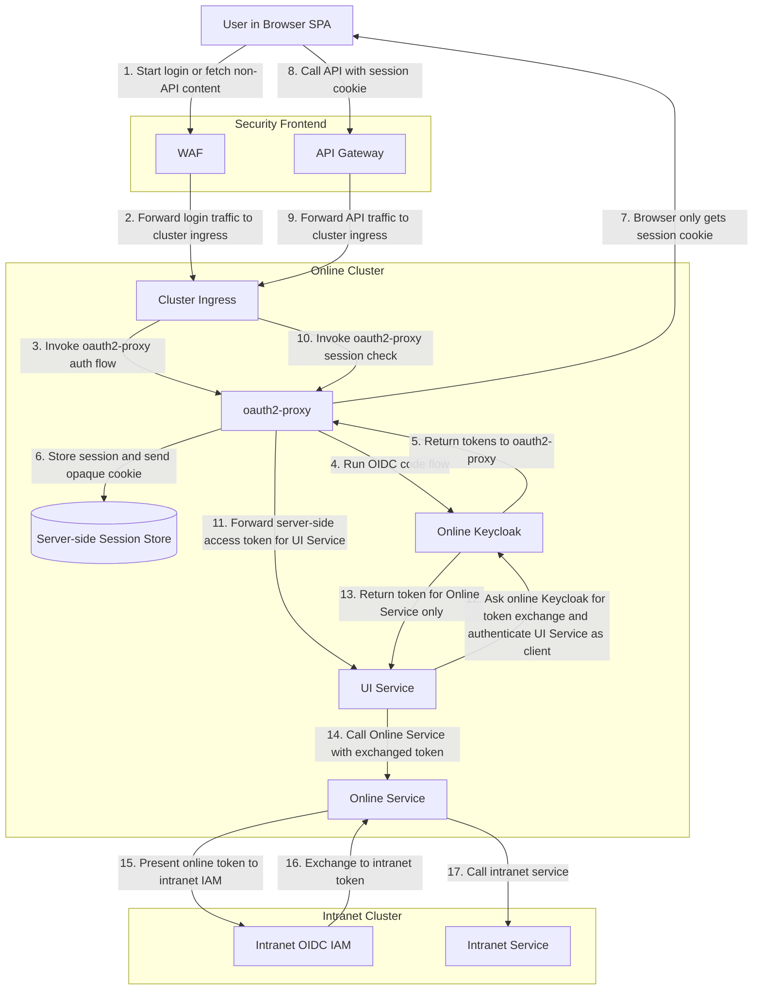
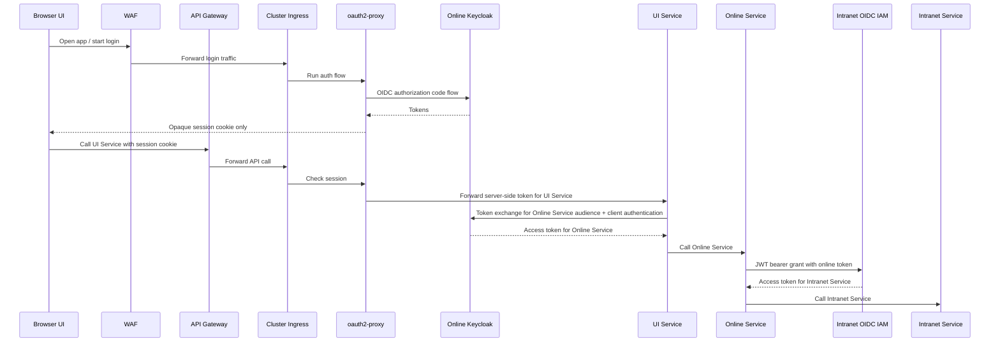

# Proposal: `oauth2-proxy` Edge Session, No Client Token

This option removes OAuth tokens from the browser. The browser only keeps a session cookie, while Keycloak remains responsible for downstream token exchange.

## What Changes

- `oauth2-proxy` handles the OIDC flow with the online IAM.
- The security frontend is split into WAF for login and non-API traffic, and API gateway for API traffic.
- `oauth2-proxy` is attached at cluster ingress rather than being called directly by the WAF.
- The browser only receives an opaque session cookie.
- The first API still receives an access token, but only server-side from `oauth2-proxy`, not from browser JavaScript.
- Internal services do not chain the browser session or a raw user token. They call Keycloak token exchange for audience-specific tokens.
- If cluster identity is used, `UI Service` presents it when calling Keycloak for token exchange. That workload identity is not processed at ingress.
- Internal online calls use Keycloak token exchange. For intranet calls, `Online Service` presents a trusted online token to the intranet IAM using JWT bearer authorization grant semantics.

## Activity View



## Concrete Example



In this variant, `Cluster ingress` routes to `oauth2-proxy`. `oauth2-proxy` performs the browser-session checks. `Online Service` calls the intranet IAM directly for the final exchange. If cluster identity is used for workload identity, it is consumed on the `UI Service -> Online Keycloak` token request, not by ingress.

## Why It Helps

- No OAuth token is exposed to browser JavaScript.
- APIs inside the cluster still use OAuth tokens, but the browser does not.
- Token scope can be reduced per hop because each internal call uses token exchange.
- The intranet IAM explicitly decides whether it trusts online tokens from Keycloak.

## How Token Exchange Works Here

- `UI Service` receives a server-side access token for itself from `oauth2-proxy`.
- When `UI Service` calls `Online Service`, it sends that token to online Keycloak using standard token exchange.
- The token request itself must also authenticate `UI Service` as a confidential client. In Keycloak 26.6.0 that client authentication can use a client secret, a signed JWT, or federated client authentication from a trusted cluster issuer such as Kubernetes.
- Online Keycloak checks that:
  - the presented token is valid
  - `UI Service` is allowed to exchange to `Online Service`
  - the requested audience and scopes are allowed
- Online Keycloak then issues a new access token for `Online Service`.

This is the part of the proposal that maps cleanly to current Keycloak standard token exchange.

## How Intranet Exchange Works Here

- `Online Service` receives an online access token from Keycloak for itself.
- When it needs an intranet token, it sends that online token to the intranet IAM using JWT bearer authorization grant semantics.
- The intranet IAM decides whether the incoming online token is trusted enough to exchange.
- If required, the intranet IAM can also require workload-based client authentication in addition to the presented online token.

## Keycloak Reality Check

- `oauth2-proxy` with OIDC works with current Keycloak.
- The exchange from `UI Service` to `Online Service` matches supported Keycloak standard token exchange V2.
- If cluster identity should replace static client secrets for `UI Service -> Keycloak`, Keycloak 26.6.0 can use federated client authentication with Kubernetes service account assertions. Using a raw SPIFFE JWT-SVID as the client assertion is not documented as a supported out-of-the-box setup and would require additional trust integration or an extension.
- The intranet step is not done in Keycloak.
- The proposal assumes the intranet IAM supports JWT bearer authorization grant or an equivalent token-exchange pattern for trusted online tokens.
- If the intranet IAM also requires workload authentication, SPIFFE-based or JWT client assertion-based client authentication can be used there.

## Standards and Tools

- `oauth2-proxy`: runs inside the online cluster, terminates the browser login flow, and keeps tokens out of the SPA.
- `WAF`: handles login traffic and non-API frontend traffic on a separate path from the API gateway.
- `API Gateway`: handles API traffic as its own entry path into the online platform.
- `Cluster ingress`: routes both WAF and API-gateway traffic into the online cluster and is the attachment point for `oauth2-proxy`, for example through Istio integration.
- `OIDC Authorization Code Flow`: used between `oauth2-proxy` and Keycloak.
- `OAuth 2.0 access tokens`: still used inside the online cluster between services.
- `OAuth 2.0 Token Exchange`: used by APIs to get a narrower token for each downstream online audience.
- `JWT Bearer Authorization Grant`: used at the intranet IAM to exchange a trusted online token for an intranet token.
- `Keycloak`: the online IAM. It handles online login and online token exchange, but not the final intranet exchange in this proposal.
- `OIDC-compliant IAM`: assumed on the intranet side, but the implementation does not matter for the proposal.

## Example Calls

Example OIDC authorization request started by `oauth2-proxy`:

```http
GET /realms/online/protocol/openid-connect/auth?
  client_id=web-edge&
  redirect_uri=https%3A%2F%2Fapp.example.com%2Foauth2%2Fcallback&
  response_type=code&
  scope=openid%20profile%20email&
  code_challenge=E9Melhoa2OwvFrEMTJguCHaoeK1t8URWbuGJSstw-cM&
  code_challenge_method=S256
Host: keycloak.online.example
```

Example token exchange from UI Service to Keycloak for Online Service:

```http
POST /realms/online/protocol/openid-connect/token
Host: keycloak.online.example
Content-Type: application/x-www-form-urlencoded

grant_type=urn:ietf:params:oauth:grant-type:token-exchange&
client_id=ui-service&
client_secret=...&
subject_token=eyJ...user_or_edge_token...&
subject_token_type=urn:ietf:params:oauth:token-type:access_token&
requested_token_type=urn:ietf:params:oauth:token-type:access_token&
audience=online-service&
scope=orders.read
```

Example same request with workload identity used as client authentication to Keycloak:

```http
POST /realms/online/protocol/openid-connect/token
Host: keycloak.online.example
Content-Type: application/x-www-form-urlencoded

grant_type=urn:ietf:params:oauth:grant-type:token-exchange&
client_assertion_type=urn:ietf:params:oauth:client-assertion-type:jwt-bearer&
client_assertion=eyJ...cluster_workload_assertion...&
subject_token=eyJ...user_or_edge_token...&
subject_token_type=urn:ietf:params:oauth:token-type:access_token&
requested_token_type=urn:ietf:params:oauth:token-type:access_token&
audience=online-service&
scope=orders.read
```

This is still token exchange. The workload JWT is used for client authentication on the request. It is not a JWT bearer authorization grant.

Example exchanged token claims for Online Service:

```json
{
  "iss": "https://keycloak.online.example/realms/online",
  "sub": "248289761001",
  "aud": "online-service",
  "azp": "ui-service",
  "scope": "orders.read"
}
```

This claim shape matches current Keycloak more closely than an explicit delegated `act` claim.

Example JWT bearer grant from Online Service to intranet IAM:

```http
POST /oauth2/token
Host: intranet-iam.example
Content-Type: application/x-www-form-urlencoded

grant_type=urn:ietf:params:oauth:grant-type:jwt-bearer&
assertion=eyJ...online_service_token_from_keycloak...&
scope=intranet.read
```

## Main Tradeoffs

- `oauth2-proxy` only meets the "no token on the client" goal when it uses a server-side session store rather than a cookie-based token session.
- The cluster ingress must run the `oauth2-proxy` auth check on both the login path and the API path. If the API gateway bypasses that ingress integration, the opaque browser session cannot authorize API calls.
- UI Service receives a server-side access token for its own audience. It does not receive the browser session cookie as an authorization artifact.
